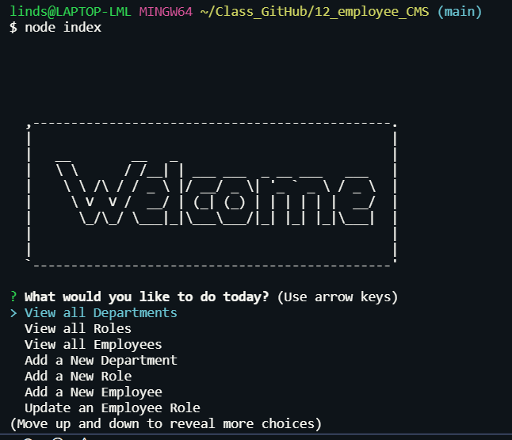
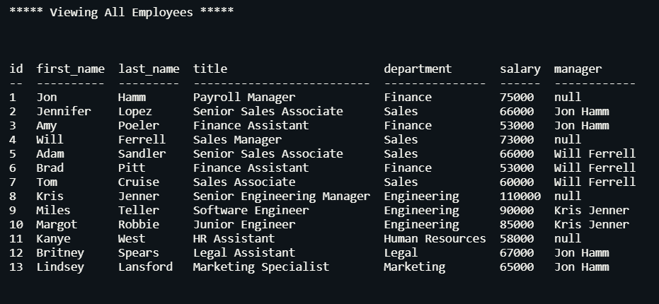

# Employee Tracker SQL Database
  

## Description

This project is a command-line application to create, read and update a company's employee database, using Node.js, Inquirer, and MySQL. 

## Table of Contents

  - [Description](#description)
  - [Table of Contents](#table-of-contents)
  - [Installation](#installation)
  - [Usage](#usage)
  - [License](#license)
  - [How to Contribute](#how-to-contribute)
  - [Tests](#tests)
  - [Questions](#questions)
  - [Walkthrough Demonstration](#walkthrough-demonstration)
  - [Mockups](#mockups)

## Installation

To install this application, you will need to clone the repo and run a few commands into the terminal.

**Installs include**:

* ``npm init``

* ``npm install inquirer@8.2.4``

* ``npm install mysql`` (This package establishes a connection to the database via Node.js)

* ``npm install dotenv`` (This package is a zero-dependency module that loads environment variables from a .env file into process.env. This will help keep your sensitive info--password--hidden from open source platforms.)

* ``npm install console.table`` (This package formats your data output in an easier to read table.) *optional*

* ``npm install asciiart-logo`` (This package renders a splash screen in text console with logo from ASCII characters.) *optional*

>_If you want to learn more about any of these npm packages, [click here](https://www.npmjs.com/)._

## Usage

The application runs via the root directory by typing ``node index.js`` into your terminal where the prompts from the ``inquirer npm pkg`` populate for user input.

## License

This project is licensed under **MIT** license.

## How to Contribute

When creating an open source project on GitHub, there is always the option for other developers to contribute to your projects. | If you would like to contribute, please contact me at the email listed below.

## Tests

At this time, no tests have been documented for this application.

## Questions

Please reach out with any questions you may have about this application.

* :octocat: GitHub: [@lindsey-lansford](https://github.com/lindsey-lansford)
* :envelope: Email: [lindsey.lansford@gmail.com](mailto:lindsey.lansford@gmail.com)

-------------------------------------------------------
## Walkthrough Demonstration

*--->* [Watch the Video](https://drive.google.com/file/d/1hrxxbfTlqJVXrlHiXiK_v7ukGwzF_NqV/view?usp=sharing)

## Mockups

*Here is an example of the initial start with the node index cmd*

*Here is an example of how the mysql data pulls through*

